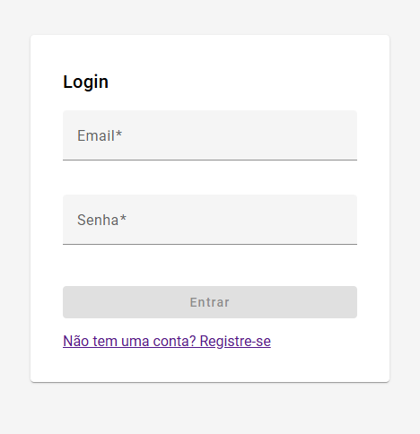
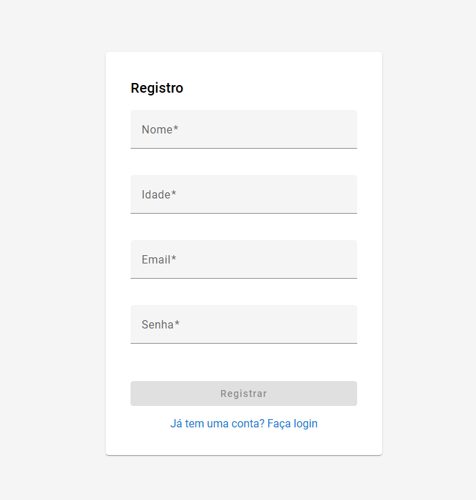
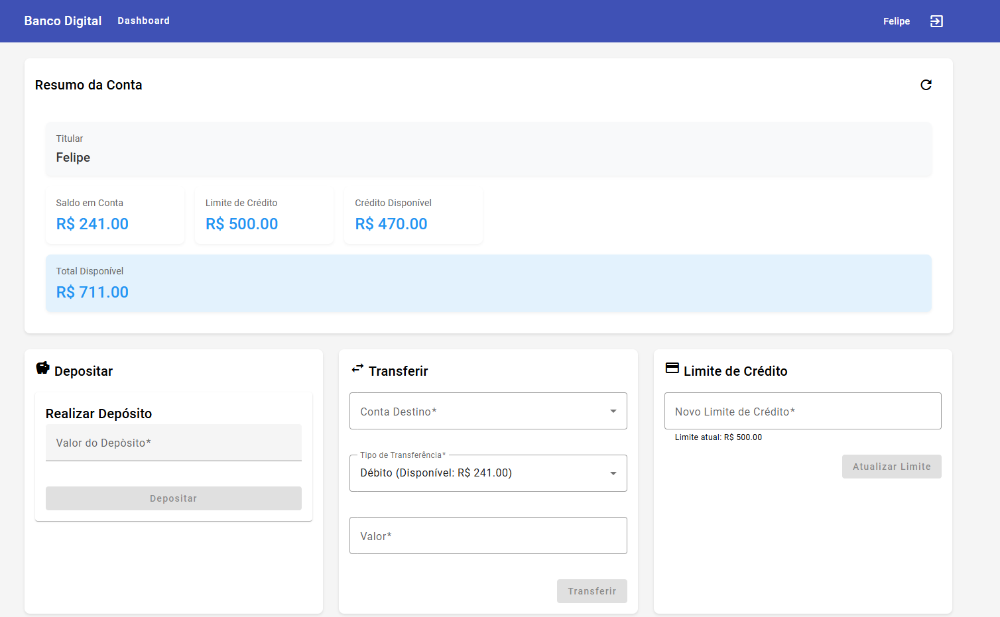
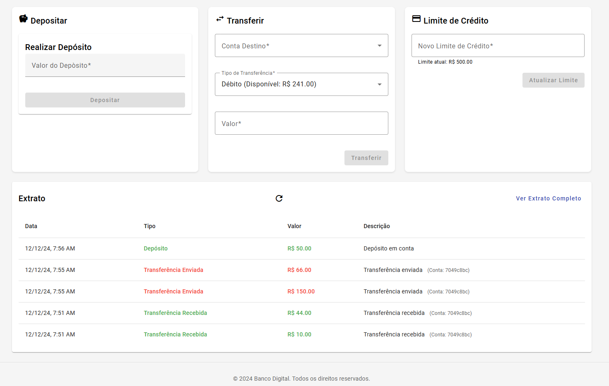
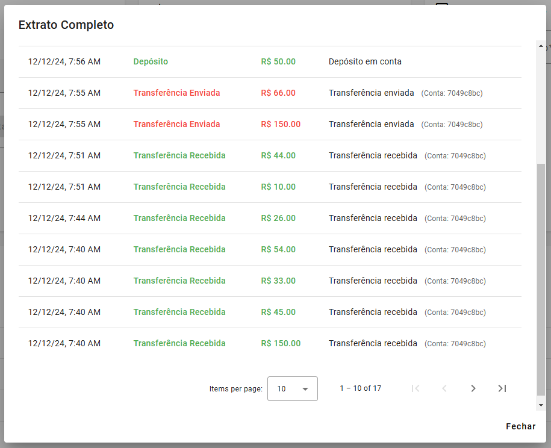

# Banco Digital - Frontend

## Acesso aplicação online
https://ebank-app-mu.vercel.app/dashboard

## Descrição
Interface web para sistema bancário desenvolvido em Angular 17. O sistema permite gerenciamento de contas, transações bancárias, consulta de extratos e administração de limite de crédito.

## Funcionalidades Principais
- Autenticação de usuários
- Visualização de saldo e limites
- Depósitos
- Transferências entre contas
- Gerenciamento de limite de crédito
- Extrato bancário com filtros por data

## Tecnologias Utilizadas
- Angular 17
- Angular Material
- RxJS
- TypeScript
- SCSS

## Pré-requisitos
- Node.js (versão 18 ou superior)
- NPM (versão 9 ou superior)
- Angular CLI (versão 17)

## Instalação
1. Clone o repositório:
```bash
git clone [URL_DO_REPOSITÓRIO]
```

2. Instale as dependências:
```bash
cd banco-digital-frontend
npm install
```

3. Configure as variáveis de ambiente:
   - Copie o arquivo `.env.example` para `.env`
   - Ajuste as variáveis conforme necessário

4. Inicie o servidor de desenvolvimento:
```bash
ng serve
```

5. Acesse `http://localhost:4200` no navegador

## Estrutura do Projeto
```
src/
├── app/
│   ├── core/                    # Serviços e guardas globais
│   ├── features/               # Módulos funcionais
│   │   ├── auth/              # Autenticação
│   │   └── dashboard/         # Dashboard principal
│   └── shared/                # Componentes compartilhados
├── assets/                    # Recursos estáticos
└── environments/              # Configurações por ambiente
```

## Screenshots

### Login

*Tela de login*

### Registro

*Tela de registro*

### Dashboard

*Dashboard com resumo da conta e operações disponíveis*


*Dashboard sessão de extrato*

### Extrato

*Visualização detalhada do extrato com filtros por data*

## Módulos Principais

### Autenticação
- Login
- Registro
- Guarda de rotas
- Interceptor JWT

### Dashboard
- Resumo da conta
- Operações bancárias
- Extrato de transações
- Gestão de limite de crédito

## Endpoints da API

### Autenticação
- POST `/api/auth/login`
- POST `/api/auth/register`

### Transações
- GET `/api/transactions/balance/{accountNumber}`
- POST `/api/transactions/deposit`
- POST `/api/transactions/transfer`
- GET `/api/accounts/{accountNumber}/statement`

## Scripts Disponíveis
- `ng serve`: Inicia o servidor de desenvolvimento
- `ng build`: Gera build de produção

## Ambiente de Produção
1. Gere o build de produção:
```bash
ng build --configuration production
```
2. Os arquivos serão gerados no diretório `dist/`

## Troubleshooting
### Problemas Comuns
1. **Erro de CORS**
   - Verifique a configuração do backend
   - Confirme as URLs no ambiente

2. **Problemas de Autenticação**
   - Verifique se o token está sendo enviado
   - Confirme se o token não expirou

3. **Erros de Build**
   - Limpe o cache: `npm cache clean --force`
   - Reinstale as dependências

## Licença
Este projeto está sob a licença [MIT](LICENSE).

## Status do Projeto
Em desenvolvimento ativo.
